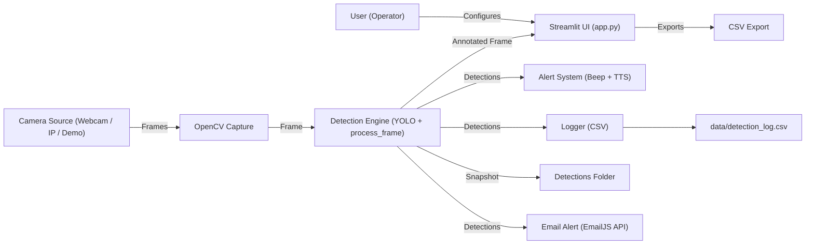
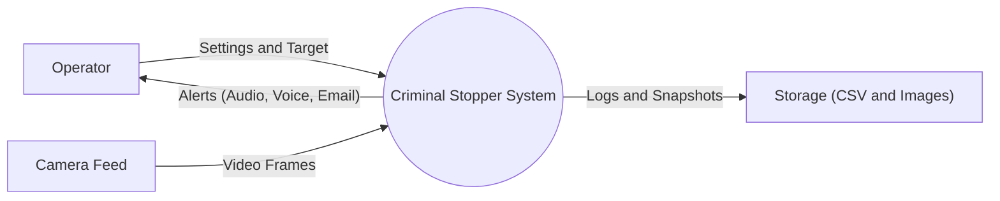
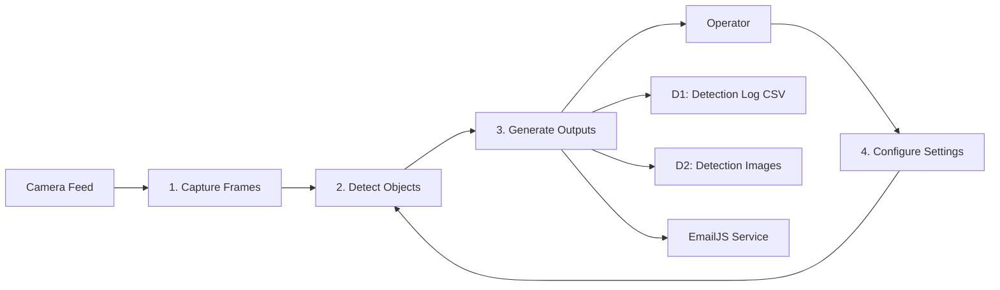
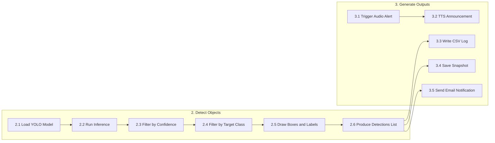
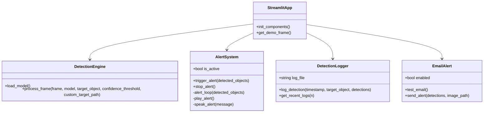
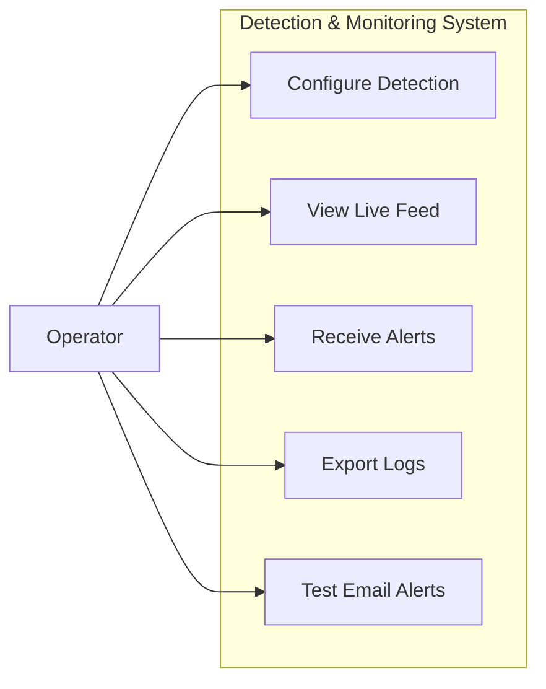
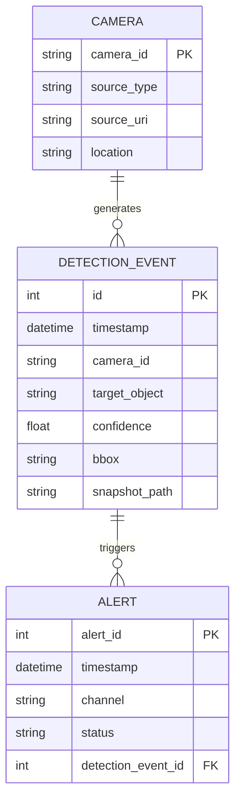
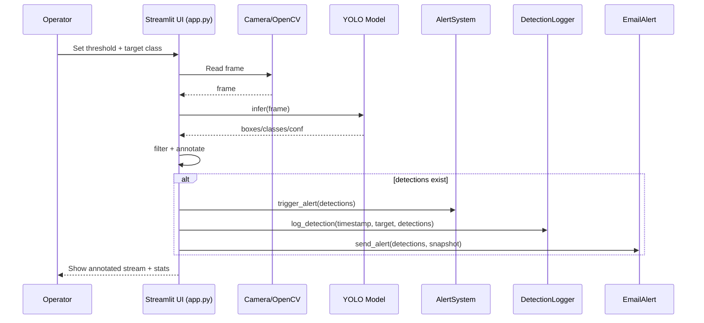

# Criminal Stopper – AI-Based Smart Surveillance & Alert System

 ## Table of Contents
 1. Title Slide
 2. Abstract
 3. Introduction
 4. Problem Statement
 5. Existing System – Limitations / Drawbacks
 6. Proposed System – Objectives / Features / Improvements
 7. Reference Theory / Background
 8. Methodology (System Workflow)
 9. Algorithms & Post-processing
 10. Literature Survey
 11. System Requirements
 12. Interface Design (UI)
 13. Data Handling & Storage
 14. System Constraints
 15. Security & Privacy Considerations
 16. Scalability & Cost Considerations
 17. System Design & Diagrams
 18. Module Descriptions with Pseudocode
 19. Testing & Validation
 20. Deployment & Maintenance
 21. Expected Results / Outputs
 22. Conclusion
 23. References
 
## Title Slide
- **Project Title**: Criminal Stopper – AI-Based Smart Surveillance & Alert System
- **Domain**: Computer Vision, Surveillance, Real-Time Object Detection, IoT/Alerting
- **Technology Stack**: Python, Streamlit, OpenCV, Ultralytics YOLO, Torch, EmailJS (HTTP API), Pandas
- **Core Modules**: Detection, Alerts (audio/voice), Logging (CSV), Email Notification

---

## Abstract (150–200 words)
Criminal Stopper is a real-time smart surveillance application that detects suspicious or target objects (e.g., person) from a live camera feed and triggers immediate alerts. The methodology uses a deep-learning object detection model (YOLO via the Ultralytics framework) integrated with OpenCV for frame acquisition and visualization. Each incoming frame is processed to infer bounding boxes and class labels, then filtered using a configurable confidence threshold and an optional user-defined target class. When detections occur, the system activates an alert subsystem (audio beep and text-to-speech), logs detection events (timestamp, confidence, and bounding box location) into a persistent CSV file for auditing, and optionally sends a notification email through EmailJS using environment-based configuration.
The expected outcome is an accessible, UI-driven monitoring dashboard built with Streamlit that provides continuous video monitoring, configurable detection controls, real-time statistics, and an evidence trail of detections with saved snapshots. The project aims to improve responsiveness and situational awareness compared with manual monitoring, while remaining lightweight enough to run on standard consumer hardware for small-scale security deployments.

---

 ## Introduction
 Modern security environments (homes, offices, campuses, public areas) rely heavily on video surveillance. While CCTV coverage is common, conventional systems frequently function as passive recorders rather than active decision-support tools. As a result, the effectiveness of surveillance depends on continuous human attention, and critical events can be missed or detected too late.
 
 Criminal Stopper addresses this gap using real-time computer vision. It processes video frames, detects objects of interest using a deep neural network, and immediately triggers alert mechanisms and logging. The design emphasizes:
 - Low operational complexity (simple UI, easy setup)
 - Fast inference suitable for near real-time monitoring
 - Evidence preservation (logs + snapshots)
 - Configurable alerting to support different deployment scenarios
 
 ### Scope
 - Single-camera stream monitoring (webcam or IP camera)
 - Real-time object detection with class-based filtering
 - On-device visual overlay of bounding boxes and confidence values
 - Alerting (audio + voice + optional email)
 - Local persistence using CSV logs and image snapshots
 
 ### Out of Scope (Current Version)
 - Facial recognition or biometric identification
 - Multi-camera orchestration and centralized management
 - Full anomaly detection (behavior-based alerts)
 - Cloud-scale storage and analytics
 
 ---

 ## Problem Statement
 Provide a user-friendly surveillance system that can:
 - Capture frames from a live camera source.
 - Detect specified target objects with adjustable confidence threshold.
 - Immediately notify stakeholders via audio/voice and (optionally) email.
 - Maintain an evidence trail of detection events and snapshots.
 - Display real-time statistics and recent detections in a dashboard.
 
 The key challenge is balancing speed and accuracy under limited compute resources while ensuring reliable alerts and maintainable logs.
 
 ---

## Existing System – Limitations / Drawbacks
- **Manual surveillance dependency**: Human operators can miss events due to fatigue and attention limitations.
- **Delayed response**: Suspicious activity is often noticed after the fact (reviewing recordings).
- **No intelligent filtering**: Traditional CCTV systems do not classify objects or prioritize alarms based on threat cues.
- **Limited auditability**: Many setups lack structured logs with confidence and object metadata.
- **Scalability issues**: Adding more cameras requires more monitoring personnel and infrastructure.

---

## Proposed System – Objectives / Features / Improvements
### Objectives
- Detect target objects in real time from live video.
- Provide instant alerts (audio/voice/email) when targets are detected.
- Maintain structured logs for analysis and evidence.
- Offer a simple UI for configuration and live monitoring.

### Key Features
- **Real-time object detection** using YOLO (Ultralytics).
- **Configurable threshold** and **target class filter** (e.g., “person”).
- **Alerting system**: audio beep + text-to-speech.
- **Email notifications** via EmailJS (optional, environment controlled).
- **Detection logging** into `data/detection_log.csv`.
- **Snapshot saving** to `detections/` for later review.
- **Dashboard**: live feed, stats, recent detection gallery.

### Improvements Over Existing System
- Faster detection and response.
- Reduced human effort and missed events.
- Better traceability via logs and saved evidence.
- More configurable and adaptable to different environments.

---

 ## Reference Theory / Background
 
 ### 1) Computer Vision Basics
 **Computer vision** attempts to interpret visual data (images/video) by extracting semantic information such as object category, location, and motion. In surveillance applications, core tasks include:
 - **Object detection**: identify and localize objects using bounding boxes.
 - **Tracking** (optional extension): maintain identities across frames.
 - **Event recognition** (advanced): detect unusual or suspicious behavior.
 
 ### 2) Convolutional Neural Networks (CNNs)
 CNNs are neural networks specialized for image data. Key concepts:
 - **Convolution layers** learn spatial filters (edges, textures, parts).
 - **Activation functions** introduce non-linearity.
 - **Pooling / striding** reduce spatial resolution while increasing receptive field.
 - **Backbones** (e.g., Darknet/ResNet) extract hierarchical features.
 
 Why CNNs are used in detection:
 - They learn features directly from data.
 - They generalize across backgrounds and lighting better than handcrafted methods.
 
 ### 3) Object Detection: Two-Stage vs One-Stage
 - **Two-stage detectors** (e.g., Faster R-CNN) generate region proposals and classify them. They are usually accurate but slower.
 - **One-stage detectors** (e.g., YOLO, SSD) predict classes and boxes in one pass. They are fast and suitable for real-time.
 
 Criminal Stopper uses **YOLO** because the system goal prioritizes real-time response.
 
 ### 4) YOLO Theory (High-Level)
 YOLO (“You Only Look Once”) performs detection as a single regression problem:
 - The model predicts bounding boxes and class probabilities.
 - Predictions occur at multiple spatial locations and scales.
 - Outputs are filtered using confidence thresholds.
 
 Practical implications:
 - Faster inference on CPUs/GPUs.
 - Good performance for common surveillance classes (person, car, etc.).
 
 ### 5) Confidence Score, IoU, and NMS
 - **Confidence score** represents how certain the model is about an object prediction.
 - **Intersection over Union (IoU)** measures overlap between two bounding boxes:
   - IoU = Area(Intersection) / Area(Union)
 - **Non-Maximum Suppression (NMS)** removes duplicate overlapping boxes by retaining the best-scoring box and suppressing others above an IoU threshold.
 
 Why it matters:
 - Lower thresholds increase recall but can increase false positives.
 - NMS prevents repeated alerts for the same object in the same frame.
 
 ### 6) Evaluation Metrics (Conceptual)
 Common metrics used in object detection research:
 - **Precision**: fraction of predicted positives that are correct.
 - **Recall**: fraction of actual positives that are detected.
 - **mAP** (mean Average Precision): summary metric across classes and IoU thresholds.
 
 In this project, real-time operational performance is emphasized; however, these metrics guide model selection when datasets and annotations are available.
 
 ### 7) Video Processing Pipeline
 A typical real-time pipeline:
 1. Capture frame from camera.
 2. Run detection model.
 3. Overlay bounding boxes on the frame.
 4. Trigger actions (alerts/logging/notifications).
 5. Display frame and statistics in UI.
 
 Bottlenecks:
 - Camera capture latency
 - Model inference time
 - UI rendering rate
 
 ### 8) Streamlit (UI Layer)
 Streamlit enables rapid dashboard-like interfaces in Python:
 - Widgets: slider, text input, file upload, buttons
 - Placeholders: update images/metrics in a loop
 
 Design reason:
 - Low complexity and fast prototyping for academic projects.
 
 ### 9) Alerting Concepts (Audio/Voice/Email)
 Multi-channel alerting improves reliability:
 - **Audio**: immediate local cue.
 - **Voice**: communicates what was detected.
 - **Email**: remote notification with timestamp/context.
 
 Alert design considerations:
 - Rate-limiting and de-duplication to prevent alert spam.
 - Fail-safe behavior when services are not configured.
 
 ### 10) Logging and Evidence Preservation
 Logging ensures traceability:
 - **CSV logs** store structured records (timestamp, class, confidence, location).
 - **Snapshots** preserve visual evidence of detections.
 
 Recommended extensions:
 - Database storage for scalable queries.
 - File rotation and retention policies.
 
 ---

 ## Methodology (System Workflow)

 This section explains the step-by-step workflow followed by the system at runtime.

 ### Step 1: Component Initialization
 - The Streamlit application starts and initializes the following components using a cached initializer:
   - **YOLO model** (Ultralytics)
   - **AlertSystem** (audio + TTS)
   - **DetectionLogger** (CSV persistence)
   - **EmailAlert** (EmailJS-based notifications, if enabled)

 ### Step 2: User Configuration via UI
 The operator configures:
 - **Confidence threshold** (0.0–1.0)
 - **Target object name** (e.g., `person`)
 - Optional **custom target image upload** (stored to `targets/`)
 - Optional email settings testing

 ### Step 3: Video Source Selection
 Supported sources:
 - **Webcam** (`0`)
 - **IP camera** (URL)
 - **Demo mode** (fallback frame / sample video option)

 ### Step 4: Frame Acquisition
 Frames are acquired using OpenCV (`cv2.VideoCapture`). If camera access fails, the system falls back to demo mode.

 ### Step 5: Frame Processing and Detection
 For every frame:
 - Run YOLO inference.
 - Convert predictions into bounding boxes with class labels and confidence.
 - Filter boxes below the configured confidence threshold.
 - If `target_object` is specified, keep only detections matching that class.
 - Draw bounding boxes and labels on the frame.

 ### Step 6: Alerting, Logging, and Evidence Capture
 If detections exist:
 - Trigger audio/voice alert.
 - Append detection details to CSV log.
 - Save annotated snapshot to `detections/`.
 - Send email alert (if configured).

 ### Step 7: Dashboard Updates
 The UI displays:
 - Annotated live feed
 - FPS estimate
 - Object counts (running totals)
 - Recent detection gallery (latest images)

 ---

 ## Algorithms & Post-processing

 ### A) Object Detection Algorithm (YOLO Inference)
 YOLO runs a forward pass through a CNN backbone and detection head to produce candidate boxes and class probabilities.

 **High-level algorithm**:
 ```text
 INPUT: frame, confidence_threshold, target_object
 OUTPUT: annotated_frame, detections[]

 1. results = YOLO(frame)
 2. detections = []
 3. For each predicted box:
      a. conf = box.conf
      b. if conf < confidence_threshold: skip
      c. label = class_name(box.cls)
      d. if target_object is set and label != target_object: skip
      e. append (label, conf, bbox) to detections
      f. draw bbox + label on frame
 4. return frame, detections
 ```

 ### B) Thresholding Strategy
 - Lower threshold (e.g., 0.3): higher recall, may increase false positives.
 - Higher threshold (e.g., 0.7): higher precision, may miss small/occluded objects.

 Recommended practice:
 - Begin at **0.5** and tune based on environment (lighting, camera angle, crowd density).

 ### C) De-duplication Across Frames (Recommended Enhancement)
 Current behavior may repeatedly alert for the same object across consecutive frames.
 
 A recommended enhancement is a **cooldown window**:
 - Maintain a timestamp for last alert.
 - If a new detection occurs within `cooldown_seconds`, skip triggering alert but still update UI.

 ### D) Bounding Box Post-processing
 Ultralytics internally applies NMS; however, conceptually:
 - Remove overlapping boxes with high IoU.
 - Keep the best-scoring candidate.

 ---

## Literature Survey (Minimum 10 Papers)

| # | Title of the Paper | Author(s) | Publication Source | Description (Key Contributions / Main Ideas) | Merits | Demerits |
|---:|---|---|---|---|---|---|
| 1 | You Only Look Once: Unified, Real-Time Object Detection | Joseph Redmon, Santosh Divvala, Ross Girshick, Ali Farhadi | arXiv:1506.02640 | Introduced YOLO as a single-stage detector treating detection as regression for real-time performance. | High speed, end-to-end pipeline. | Lower localization accuracy vs some two-stage methods (early versions). |
| 2 | YOLO9000: Better, Faster, Stronger (YOLOv2) | Joseph Redmon, Ali Farhadi | arXiv:1612.08242 | Improved YOLO with anchor boxes, batch norm, higher resolution training; joint training for detection + classification. | Better accuracy with real-time speed; large label space. | Still challenged by small objects and crowded scenes. |
| 3 | YOLOv3: An Incremental Improvement | Joseph Redmon, Ali Farhadi | arXiv:1804.02767 | Multi-scale predictions, Darknet-53 backbone, improved performance for small objects. | Good accuracy-speed tradeoff; multi-scale detection. | Heavier model; still not best AP vs newer detectors. |
| 4 | YOLOv4: Optimal Speed and Accuracy of Object Detection | Alexey Bochkovskiy, Chien-Yao Wang, Hong-Yuan Mark Liao | arXiv:2004.10934 | Consolidated training “bag of freebies/specials” improving accuracy while keeping speed. | Strong accuracy with real-time inference. | More complex training recipe; many hyperparameters. |
| 5 | Faster R-CNN: Towards Real-Time Object Detection with Region Proposal Networks | Shaoqing Ren, Kaiming He, Ross Girshick, Jian Sun | arXiv:1506.01497 | Two-stage detection with RPN generating proposals; strong accuracy baseline. | High detection quality and robust proposals. | Slower than one-stage for real-time use on limited hardware. |
| 6 | SSD: Single Shot MultiBox Detector | Wei Liu et al. | arXiv:1512.02325 | One-stage detector with multi-scale feature maps and default boxes. | Fast inference; simpler pipeline. | Lower small-object accuracy compared with later detectors. |
| 7 | Focal Loss for Dense Object Detection (RetinaNet) | Tsung-Yi Lin et al. | arXiv:1708.02002 | Focal loss addresses class imbalance to improve one-stage detectors. | High accuracy for one-stage detection. | Computationally heavy vs lightweight real-time models. |
| 8 | EfficientDet: Scalable and Efficient Object Detection | Mingxing Tan, Ruoming Pang, Quoc V. Le | arXiv:1911.09070 (ICCV 2019) | BiFPN + compound scaling for efficient accuracy improvements. | Strong efficiency; scalable across sizes. | More involved architecture; tuning complexity. |
| 9 | Simple Online and Realtime Tracking with a Deep Association Metric (Deep SORT) | Nicolai Wojke, Alex Bewley, Dietrich Paulus | arXiv:1703.07402 | Adds deep appearance embeddings to SORT for improved identity association. | Robust multi-object tracking; fewer ID switches. | Needs re-ID model; extra compute and complexity. |
| 10 | ByteTrack: Multi-Object Tracking by Associating Every Detection Box | Yifu Zhang et al. | arXiv:2110.06864 | Uses both high and low score detections to improve association and recall. | Strong tracking in crowded scenes; high MOT accuracy. | Depends heavily on detector quality; association tuning. |
| 11 | Deep Learning for Video Anomaly Detection: A Review | (Survey paper; see arXiv:2409.05383) | arXiv:2409.05383 | Reviews modern deep learning approaches for detecting anomalous events in videos. | Good overview for extending beyond object detection. | Survey; not a direct deployable method by itself. |

---

## System Requirements

### Software Requirements
- **Operating System**: Windows / Linux
- **Language**: Python 3.11+
- **Libraries**:
  - `streamlit`
  - `opencv-python` / `opencv-python-headless`
  - `ultralytics`
  - `torch`
  - `numpy`, `pandas`
  - `pyttsx3`, `pygame`
  - `requests`, `python-dotenv`
- **Optional services**:
  - EmailJS account for email alerts

### Non-Functional Requirements
- **Usability**: minimal steps to start monitoring; clear UI elements.
- **Availability**: degrade gracefully if email is not configured.
- **Maintainability**: modular utilities (`utils/`) for alerts, logging, detection.
- **Portability**: run on Windows/Linux with standard Python environment.

---

## Hardware Requirements
- **CPU**: Intel i5 / Ryzen 5 or better (minimum), higher recommended for real-time
- **RAM**: 8 GB minimum, 16 GB recommended
- **Storage**: 2 GB+ free for dependencies and saved detection images
- **Camera**:
  - USB webcam or
  - IP camera stream URL
- **Optional GPU**: CUDA-capable GPU improves FPS (not required)

---

## Interface Design – UI Mockups / Wireframes

### Main Dashboard (Wireframe)
```text
+--------------------------------------------------------------+
| Criminal Stopper - Security System                            |
+------------------------------+-------------------------------+
| Live Camera Feed             | Active Detection              |
| [ Video Stream Placeholder ] | - FPS                         |
|                              | - Target                      |
|                              | - Confidence                  |
|                              | - Active Alerts               |
|                              | - Mode (Demo/Live)            |
+------------------------------+-------------------------------+
|                              | Detection Statistics          |
|                              | - object: count               |
|                              | - object: count               |
|                              |                               |
|                              | Recent Detections Gallery     |
|                              | [img1] [img2] [img3] [img4]   |
+------------------------------+-------------------------------+

Sidebar:
- Confidence Threshold (slider)
- Target Object Name (text)
- Upload Target Image
- Export Detection Data
- Email Alert Settings + Test
```

### Sidebar (Wireframe)
```text
Control Panel
------------
[Confidence Threshold Slider]
[Target Object Name Input]

Custom Target Settings
---------------------
[Upload Target Image Button]
[Preview Uploaded Image]

Export
------
[Export Detection Data Button]

Email Alert Settings
-------------------
[Configured/Not Configured Status]
[Test Email Alert Button]
```

---

## Data Handling & Storage

### Data Types Handled
- **Live video frames**: processed in-memory; not persisted continuously.
- **Detections metadata**: class label, confidence score, bounding box coordinates.
- **Evidence images**: annotated snapshots saved when detections occur.
- **Logs**: structured CSV rows for each detected object.

### Storage Locations (Current Implementation)
- **Detection snapshots**: `detections/` (JPG files)
- **Detection logs**: `data/detection_log.csv`
- **User-uploaded target images**: `targets/`

### Data Format
- **CSV log schema (current)**:
  - `timestamp`
  - `target_object`
  - `confidence`
  - `location` (bounding box coordinates serialized as string)

### Data Retention (Recommended Policy)
- Keep snapshots for a defined duration (e.g., 7–30 days), then archive or delete.
- Rotate logs monthly to avoid unbounded file growth.
- Maintain backups if the application is used for compliance/auditing.

### Data Quality Considerations
- Detection quality depends on camera angle, lighting, and model selection.
- Avoid overly low confidence thresholds which may increase false positives and unnecessary storage.

---

## System Constraints
- **Performance**:
  - FPS depends on CPU/GPU, camera resolution, and YOLO model size.
  - Higher resolution increases detection latency.
- **Security**:
  - Environment variables must be protected (`.env` should not be publicly shared).
  - If IP camera URL includes credentials, handle carefully.
- **Scalability**:
  - Current implementation is designed for single-stream monitoring.
  - Multi-camera support increases compute and UI complexity.

### Assumptions
- Stable camera feed availability.
- Adequate lighting or camera quality for detection.
- Network connectivity if IP camera or EmailJS is used.

### Limitations (Current Implementation)
- Infinite processing loop is best suited for controlled demo setups; production deployments usually need stop controls and rate-limits.
- Duplicate detections across consecutive frames can generate repeated alerts without additional logic.

---

## Security & Privacy Considerations

### Security
- **Secrets management**: EmailJS keys and recipient details are read from environment variables; avoid hardcoding.
- **Network security**: if using IP cameras over a network, use secure network configurations and avoid exposing streams publicly.
- **Dependency security**: keep Python packages updated and pin versions if needed for stability.

### Privacy
- **Surveillance compliance**: deployments may require signage, consent, or regulatory compliance depending on region.
- **Data minimization**: only store snapshots when detections occur; do not continuously record unless explicitly required.
- **Access control (future scope)**: add login/role-based access if multiple operators will access the dashboard.

---

## Scalability & Cost Considerations

### Scalability
- **Compute scaling**: higher resolution streams and multiple cameras require additional CPU/GPU resources.
- **Storage scaling**: evidence images can grow quickly; apply retention rules.
- **Notification scaling**: rate-limit alerts to avoid excessive emails and operator fatigue.

### Cost Factors
- Hardware cost: CPU/GPU, cameras, storage.
- Operational cost: electricity, maintenance, network bandwidth.
- Optional service cost: EmailJS plan limits, if applicable.

---

## Architectural Diagram (High-Level)


---

## Data Flow Diagram (DFD)

### Level 0 (Context Diagram)


### Level 1 (Major Processes)


### Level 2 (Decomposition of Detection + Output)


---

## Class Diagram (UML)


---

## Use Case Diagram


---

## Entity Relationship (ER) Diagram – Database Schema
> Current implementation uses CSV files instead of a database. The ER diagram below represents a recommended schema if migrated to SQL.



---

## Sequence Diagram – Key Interaction Flow


---

## Module Descriptions with Pseudocode (Core Logic)

### Module: `utils/detection.py`
**Purpose**: Load model and detect objects in frames.

```text
FUNCTION load_model():
  model <- YOLO(weights_path)
  RETURN model

FUNCTION process_frame(frame, model, target_object, threshold, custom_target_path):
  results <- model(frame)
  detections <- empty list

  FOR each result IN results:
    FOR each box IN result.boxes:
      conf <- box.conf
      IF conf < threshold: CONTINUE

      cls_id <- box.cls
      label <- model.names[cls_id]

      IF target_object is not empty AND label != target_object:
        CONTINUE

      coords <- box.xyxy
      draw_rectangle(frame, coords)
      draw_label(frame, label, conf)

      append {class: label, confidence: conf, box: coords} to detections

  RETURN frame, detections
```

### Module: `utils/alert.py`
**Purpose**: Provide audio + speech alerts.

```text
FUNCTION trigger_alert(detected_objects):
  IF is_active == FALSE:
    is_active <- TRUE
    start a daemon thread running alert_loop(detected_objects)

FUNCTION alert_loop(detected_objects):
  WHILE is_active:
    play_beep()
    IF detected_objects not empty:
      speak("Alert! Detected ...")
    sleep(2)

FUNCTION stop_alert():
  is_active <- FALSE
  join thread
```

### Module: `utils/logger.py`
**Purpose**: Persist detection events.

```text
FUNCTION log_detection(timestamp, target_object, detections):
  FOR each detection IN detections:
    row <- {timestamp, target_object, confidence, location=bbox}
    append row to CSV
```

### Module: `utils/email_alert.py`
**Purpose**: Optional notification using EmailJS.

```text
FUNCTION send_alert(detections, image_path):
  IF not enabled: RETURN FALSE
  payload <- build template params (timestamp, objects, confidence, ...)
  response <- HTTP POST to EmailJS endpoint
  IF status == 200: RETURN TRUE ELSE RETURN FALSE
```

### Module: `app.py`
**Purpose**: Streamlit UI + real-time pipeline.

```text
INIT cached components (YOLO model, alerts, logger, email)
READ UI inputs (threshold, target)
INIT camera capture
LOOP:
  frame <- read from camera (or demo frame)
  processed_frame, detections <- process_frame(...)
  show processed_frame
  update counters + FPS
  IF detections exist:
    trigger alerts, log CSV, save snapshot, send email
  update stats + gallery
```

---

## Testing & Validation

### Test Scenarios
- **Camera access test**: verify webcam/IP camera is accessible; fallback to demo mode.
- **Detection threshold test**: check behavior at low (0.2) vs high (0.8) thresholds.
- **Target class test**: set target to `person` and verify other classes are ignored.
- **Alert test**: confirm audio beep and TTS trigger when detections exist.
- **Logging test**: verify CSV rows are appended with correct timestamp/confidence/bbox.
- **Snapshot test**: ensure `detections/` receives images and gallery shows latest files.
- **Email test**: if configured, verify EmailJS request succeeds and recipient receives message.

### Validation Approach
- Functional verification via controlled inputs (recorded videos / known objects).
- Observing false positives/negatives by varying lighting and camera position.
- Performance observation by measuring effective FPS displayed in the UI.

---

## Deployment & Maintenance

### Deployment Steps (Local)
1. Install Python 3.11+.
2. Install dependencies (via `requirements.txt` or `pyproject.toml`).
3. Configure `.env` (optional) for EmailJS.
4. Run: `streamlit run app.py`.

### Maintenance Considerations
- Periodically clean the `detections/` folder to control disk usage.
- Backup `data/detection_log.csv` if audit history is important.
- Update model weights as needed to improve detection quality.

---

## Expected Results / Outputs

### Expected Functional Outputs
- **Live annotated video feed** with bounding boxes and labels.
- **Detection statistics** (object counts).
- **Saved detection snapshots** in `detections/`.
- **CSV detection log** in `data/detection_log.csv`.
- **Audio + voice alerts** when detections occur.
- **Email alert** (optional) containing detection summary and timestamp.

### Sample Output Artifacts (What the evaluator should see)
- A growing list of images in `detections/` with timestamps.
- A CSV file where each new detection appends a new row.
- UI updated continuously with:
  - FPS value
  - Mode (Demo/Live)
  - Current target and confidence threshold

### Expected Performance (Typical Ranges)
- On CPU-only systems: performance depends strongly on camera resolution and model size.
- A practical target is a “smooth enough” live feed for monitoring; if FPS is low, reduce resolution or use a lighter model.

---

## Conclusion (Impact & Future Scope)
Criminal Stopper demonstrates a practical real-time surveillance pipeline by combining YOLO-based object detection with user-configurable controls, alerting, evidence capture, and logging. The system can reduce missed incidents and improve response time compared with fully manual monitoring. Future scope includes multi-camera support, persistent database storage, role-based access control, improved alert prioritization, face/person re-identification, integration of multi-object tracking, and anomaly detection models to detect suspicious behavior beyond object presence.

---

## References
1. Redmon, J., Divvala, S., Girshick, R., Farhadi, A. “You Only Look Once: Unified, Real-Time Object Detection.” arXiv:1506.02640. https://arxiv.org/abs/1506.02640
2. Redmon, J., Farhadi, A. “YOLO9000: Better, Faster, Stronger.” arXiv:1612.08242. https://arxiv.org/abs/1612.08242
3. Redmon, J., Farhadi, A. “YOLOv3: An Incremental Improvement.” arXiv:1804.02767. https://arxiv.org/abs/1804.02767
4. Bochkovskiy, A., Wang, C.-Y., Liao, H.-Y. M. “YOLOv4: Optimal Speed and Accuracy of Object Detection.” arXiv:2004.10934. https://arxiv.org/abs/2004.10934
5. Ren, S., He, K., Girshick, R., Sun, J. “Faster R-CNN: Towards Real-Time Object Detection with Region Proposal Networks.” arXiv:1506.01497. https://arxiv.org/abs/1506.01497
6. Liu, W., Anguelov, D., Erhan, D., Szegedy, C., Reed, S., Fu, C.-Y., Berg, A. C. “SSD: Single Shot MultiBox Detector.” arXiv:1512.02325. https://arxiv.org/abs/1512.02325
7. Lin, T.-Y., Goyal, P., Girshick, R., He, K., Dollár, P. “Focal Loss for Dense Object Detection.” arXiv:1708.02002. https://arxiv.org/abs/1708.02002
8. Tan, M., Pang, R., Le, Q. V. “EfficientDet: Scalable and Efficient Object Detection.” arXiv:1911.09070. https://arxiv.org/abs/1911.09070
9. Wojke, N., Bewley, A., Paulus, D. “Simple Online and Realtime Tracking with a Deep Association Metric.” arXiv:1703.07402. https://arxiv.org/abs/1703.07402
10. Zhang, Y., Sun, P., Jiang, Y., et al. “ByteTrack: Multi-Object Tracking by Associating Every Detection Box.” arXiv:2110.06864. https://arxiv.org/abs/2110.06864
11. “Deep Learning for Video Anomaly Detection: A Review.” arXiv:2409.05383. https://arxiv.org/abs/2409.05383
